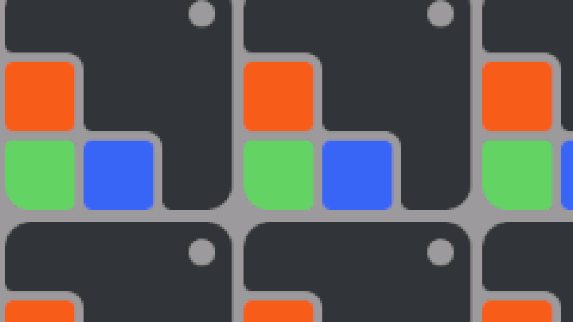

# esp32-display-qemu-demo

Run an LVGL benchmark on the official **ESP32 QEMU emulator** — no real hardware
required — and capture a real, reproducible screenshot from the device
framebuffer over UART.



> Above: actual LVGL `lv_demo_benchmark` frame rendered inside QEMU at 240×135
> (RGB565), captured via UART base64 dump and decoded back to PNG on the host.
> The dimming overlay in the corner is the LVGL `LV_USE_PERF_MONITOR` widget.

---

## Why

Embedded UI work normally needs the physical display attached. This project
shows a fully self-contained loop:

1. **Build** an ESP-IDF firmware that boots LVGL with a 240×135 RGB565 display.
2. **Run** it in QEMU's `xtensa` machine — fully headless.
3. **Capture** a single LVGL framebuffer over UART as base64.
4. **Decode** the base64 stream back to a PNG on the host.
5. **Verify** with a 10-check assertion harness so a green run is provable in CI.

Everything is driven by two scripts:

```bash
bash tools/run-qemu.sh 45 verify        # boots QEMU, runs ~7s, verifies, dumps log
python3 tools/decode-fb.py /tmp/esp32-qemu-serial.log docs/screenshot.png --scale 4
```

---

## Prerequisites

### macOS (tested)

```bash
brew install pixman libgcrypt sdl2 tmux
```

### Linux (Ubuntu/Debian)

```bash
sudo apt update
sudo apt install -y build-essential ninja-build cmake git tmux \
    libpixman-1-dev libgcrypt20-dev libsdl2-dev \
    libglib2.0-dev libslirp-dev pkg-config python3-venv
```

Other distributions: install equivalents of the above. The locally-built QEMU
(`tools/build-qemu.sh`) needs `pixman`, `libgcrypt`, `sdl2`, `glib`, and
`slirp` development headers; everything else is standard ESP-IDF.

### ESP-IDF + QEMU

This project targets **ESP-IDF v5.5+** with the prebuilt Espressif QEMU.

```bash
# 1. Install ESP-IDF v5.5+ (skip if you already have it)
#    https://docs.espressif.com/projects/esp-idf/en/latest/esp32/get-started/
#    Default expected location: $HOME/esp-idf
#    Override with `export IDF_PATH=/your/path/to/esp-idf` if you keep it elsewhere;
#    .env.sh and tools/*.sh both honour $IDF_PATH.

# 2. Install the prebuilt qemu-xtensa via idf_tools
python3 $IDF_PATH/tools/idf_tools.py install qemu-xtensa
. $IDF_PATH/export.sh                   # makes idf.py + qemu-system-xtensa visible
```

> **macOS 12 (Monterey)?** The IDF-managed `qemu-xtensa` binary requires macOS
> 13+. Build QEMU 9.2.2 locally instead — `bash tools/build-qemu.sh` patches
> meson for Apple Clang 14 and produces `tools/qemu-src/build/qemu-system-xtensa`,
> which `tools/run-qemu.sh` picks up automatically. The screenshot above was
> captured end-to-end through this locally-built binary.
>
> **Linux**: `tools/build-qemu.sh` works as-is (the meson/clang patch is a
> no-op when not building under Apple Clang). The IDF-managed binary works
> too on any reasonably recent distribution; pick whichever is more
> convenient.

### Project Python environment

```bash
cd esp32-display-qemu-demo
python3 -m venv .venv
source .venv/bin/activate
pip install -r requirements.txt          # Pillow, pytest, websockets, aiohttp, playwright
playwright install chromium               # only needed for tests/cdp/ (≈100 MB)
```

---

## Quickstart

```bash
. $IDF_PATH/export.sh
source .venv/bin/activate

idf.py set-target esp32                  # one time
idf.py build                             # ~60 s clean / ~5 s incremental

bash tools/run-qemu.sh 45 verify         # boots, captures FB, verifies (10/10)
python3 tools/decode-fb.py /tmp/esp32-qemu-serial.log /tmp/shot.png --scale 4
open /tmp/shot.png                       # macOS
```

Expected verify output:

```
[run-qemu] === Verification ===
  ✅ app_main reached
  ✅ lvgl initialized log
  ✅ lvgl display created
  ✅ lvgl flush callback fired
  ✅ demo started
  ✅ demo rendered ≥30 flushes (≥1s)
  ✅ framebuffer capture begin marker
  ✅ framebuffer capture end marker
  ✅ demo completion banner
  ✅ framebuffer payload size  (1440 base64 lines, expected 1440)
[run-qemu] Result: 10 passed, 0 failed
```

A one-shot wrapper is also available:

```bash
bash tools/start-demo.sh                 # full: build + boot + verify
bash tools/start-demo.sh quick           # skip build
```

### Stock ESP-IDF Wi-Fi Samples

The QEMU Wi-Fi simulator can also build and run stock ESP-IDF Wi-Fi samples
without editing their `.c` or `.h` files. The basic release gate covers
station, scan, and softAP:

```bash
LOG_DIR=/tmp/qemu-wifi-smoke bash tools/run-basic-wifi-smoke.sh 60
```

See [docs/qemu-wifi-stock-samples.md](docs/qemu-wifi-stock-samples.md) for the
per-sample build/run commands, expected serial logs, and known release limits.

### QEMU-native WebSocket viewer (recommended, no host bridge needed)

`tools/run-direct-demo.sh` boots the patched QEMU binary whose built-in
`esp_rgb` device streams frames **directly** over a WebSocket — no host-side
fb_server or shared memory file required:

```bash
bash tools/run-direct-demo.sh            # start QEMU + open browser automatically
bash tools/run-direct-demo.sh --no-browser  # just print the URL, Ctrl-C to stop
bash tools/run-direct-demo.sh --port 9335   # override WS port (default: 9334)
```

Open `http://127.0.0.1:8090/qemu-direct.html?port=9334` in Chrome. LVGL
content appears ~3 s after boot; after the benchmark finishes the firmware
loops an animated RGB565 gradient (~30 fps).

The acceptance test for this path: `pytest tests/cdp/test_qemu_direct_canvas.py`.

### Live Chrome viewer (legacy, file-mmap bridge)

`tools/run-demo.sh` boots QEMU with the `esp_rgb` VRAM mmap'd to a host file,
starts the fb_server in `raw-vram` mode, and (interactively) opens the canvas
viewer in your default browser:

```bash
bash tools/run-demo.sh                   # interactive, Ctrl-C to stop
bash tools/run-demo.sh --auto-test       # headless Playwright canvas check
bash tools/run-demo.sh --no-browser      # just keep the pipeline up
VRAM_Y=200 bash tools/run-demo.sh        # show the frozen hero snapshot instead
```

The default reads the **live mirror** at `y=0`: while the LVGL benchmark
runs you see the demo widgets, and once the benchmark completes the firmware
keeps painting an animated RGB565 gradient directly into VRAM (Day 23) so the
canvas never freezes. `VRAM_Y=200` switches to the frozen hero snapshot
captured at flush #80.

The auto-test path is the same one driven by `tests/cdp/test_live_qemu_canvas.py`,
so you can use it as an end-to-end smoke test from the shell. Output:
`artifacts/run-demo-canvas.png`.

---

## How the screenshot pipeline works

```
  ┌──────────────┐    flush_cb #80    ┌──────────────────────┐
  │   LVGL       │ ─────────────────▶ │ dump_framebuffer_     │
  │   benchmark  │  (RGB565, 64.8 KB) │ base64()              │
  └──────────────┘                    └─────────┬────────────┘
                                                │ <<<FB_BEGIN size=64800 …>>>
                                                │ FB=<base64 line × 1440>
                                                │ <<<FB_END>>>
                                                ▼
  ┌──────────────────────┐    UART    ┌──────────────────────┐
  │ tools/run-qemu.sh    │ ─────────▶ │ /tmp/esp32-qemu-      │
  │ (10-check verify)    │            │ serial.log            │
  └──────────────────────┘            └─────────┬────────────┘
                                                │
                                                ▼
                              ┌────────────────────────────────┐
                              │ tools/decode-fb.py             │
                              │   - parse FB_BEGIN/END markers │
                              │   - base64-decode payload      │
                              │   - RGB565 LE → RGB888         │
                              │     (bit-replication)          │
                              │   - PIL Image.save("PNG")      │
                              └────────────────┬───────────────┘
                                               ▼
                                       docs/screenshot.png
```

Key numbers:

| Item | Value |
|---|---|
| Display | 240 × 135 RGB565 (64 800 bytes) |
| Capture frame | flush #80 (mid-benchmark) |
| Base64 lines | 1 440 (60 chars each, prefixed `FB=`) |
| Verify duration | ~7 s of QEMU + ~6 s UART drain → use `45 s` timeout |
| Binary | 776 KB / 1 024 KB partition (76 %) |

---

## Testing

```bash
source .venv/bin/activate
pytest                                   # 34 tests, ~26 s warm / ~80 s cold
```

The suite reuses `/tmp/esp32-qemu-serial.log` if it's < 30 minutes old; otherwise
it boots QEMU once via `tools/run-qemu.sh`. Each of the 10 verify checks plus
two end-to-end decoder tests appears as an individual pytest case so CI failures
pinpoint the regression. `tests/fb_server/` adds 5 more tests covering the
Chrome framebuffer bridge (protocol, server e2e, static HTTP). `tests/cdp/`
drives a real headless Chromium via Playwright/CDP — it boots the bridge,
opens the viewer page, asserts the canvas is connected and animating, and
saves `artifacts/cdp-framebuffer.png` for inspection.

Set `ESP32_QEMU_LOG=/path/to/log` to test against a captured log without
booting QEMU at all.

---

## Chrome framebuffer viewer (preview)

`tools/fb_server/` ships an early Phase-1 prototype of the long-term Chrome
super-simulator: a Python WebSocket bridge plus a vanilla-JS Canvas client that
together render a 240×135 RGB565 framebuffer in real time.

Two frame sources are supported:

```bash
source .venv/bin/activate

# (a) synthetic moving rect — no QEMU required
python -m tools.fb_server.server                                       # ws=7788, http=8080

# (b) replay a real LVGL frame from a captured QEMU serial log
python -m tools.fb_server.server --source log --fb-log /tmp/esp32-qemu-serial.log --fps 1

open http://127.0.0.1:8080                                             # macOS — opens Chrome viewer
```

Mode (b) parses the same `<<<FB_BEGIN ... FB= ... FB_END>>>` block that
`tools/decode-fb.py` understands, so any log captured by `tools/run-qemu.sh`
will render directly in Chrome. Real-time push from a live `flush_cb` (TCP /
QEMU chardev / shared-memory) is the next milestone — log-replay is the
zero-firmware-change first step that proves the pipeline end-to-end.

### Touch input (Phase-3 host slice)

The Chrome canvas captures pointer events (mouse / touch / pen) and sends
structured JSON over the same WebSocket:

```json
{"type":"touch","event":"down","x":120,"y":68,"id":0}
```

The server logs each event and keeps a 256-entry ring buffer accessible at
`GET /api/touches` (Playwright tests use this to assert click → server
round-trip works). Wiring those events into a real LVGL `indev` driver in
firmware is the next step under `cdp-phase3-touch-input`.

### Super-sim side panel (Phase-6)

Beside the framebuffer, the page hosts collapsible side-panels for **Wi-Fi**
state, **System** counters (heap / uptime / tasks), a scrolling **Logs** view,
and a **Controls** group with a one-click **Screenshot** button (saves the
current canvas as PNG). Panels stay empty until the server pushes new frame
types over the existing WebSocket — the format is intentionally extensible:

```json
{"type":"telemetry","wifi":{"state":"STA_GOT_IP","ip":"10.0.0.7","rssi":-45},
                    "sys":{"heap":123456,"uptime":42,"tasks":17}}
{"type":"log","level":"W","tag":"wifi","msg":"weak signal"}
```

Older servers that only emit `fb_init` / `fb_update` keep working unchanged.
A test hook `window.__superSim` exposes `applyTelemetry` / `appendLog` so
Playwright can drive the panels without round-tripping a WebSocket.

---

## Project structure

```
esp32-display-qemu-demo/
├── main/
│   └── main.c                  # LVGL init + benchmark + FB capture (150 lines)
├── sdkconfig.defaults          # LVGL config (incl. LV_USE_SYSMON + PERF_MONITOR)
├── tools/
│   ├── run-qemu.sh             # boot QEMU + 10-check verify
│   ├── start-demo.sh           # one-click: build + boot + verify
│   ├── decode-fb.py            # FB log → PNG (RGB565 → RGB888)
│   ├── build-qemu.sh           # build qemu-system-xtensa from chinawrj/qemu fork
│   └── fb_server/              # Phase-1 Chrome FB bridge (WS + static HTTP)
├── web/                        # Canvas viewer for the FB bridge
│   ├── index.html
│   ├── main.js                 # FB decode + WS client + pointer wiring
│   ├── sidepanel.js            # super-sim panels (Wi-Fi/system/logs/screenshot)
│   └── style.css
├── tests/
│   ├── conftest.py             # session fixture: reuse log or boot QEMU once
│   ├── test_qemu_boot.py       # 10 verify checks as parametrized pytest cases
│   ├── test_decoder.py         # decode-fb.py end-to-end (Pillow assertions)
│   ├── fb_server/              # protocol + server e2e tests
│   └── cdp/                    # Playwright/CDP browser-driven UI tests
├── docs/
│   ├── screenshot.png          # committed baseline (this README's hero image)
│   ├── m4-day6-serial.log      # trimmed serial log proving 10/10 verify
│   ├── qemu-native-fb.md       # Phase-5 investigation: native QEMU FB bridge
│   └── realtime-push.md        # Phase-2b design: live push (chardev/TCP/shmem)
├── requirements.txt            # Python deps (Pillow, websockets, aiohttp, playwright)
└── .copilot/docs/skill-feedback.md   # iterative skill improvements log
```

---

## Troubleshooting

**`region 'dram0_0_seg' overflowed by N bytes`**
A 64 KB framebuffer in `.bss` exceeds ESP32's DRAM segment. The framebuffer is
allocated at runtime via `heap_caps_malloc(MALLOC_CAP_8BIT)` to avoid this. If
you add more globals, watch the link error closely.

**Screenshot is solid orange (single colour)**
LVGL hasn't drawn benchmark content yet at the capture frame. Bump
`CAPTURE_FLUSH_INDEX` in `main/main.c` (currently `80`).

**"LV_USE_PERF_MONITOR is not enabled" banner appears**
`LV_USE_PERF_MONITOR` is gated on `LV_USE_SYSMON` in LVGL's `lv_conf_internal.h`.
Both must be set in `sdkconfig.defaults`. Already configured here — only relevant
if you fork the config.

**`qemu-system-xtensa: command not found`**
Run `python3 $IDF_PATH/tools/idf_tools.py install qemu-xtensa` and re-source
`$IDF_PATH/export.sh`. The binary lands under
`~/.espressif/tools/qemu-xtensa/<version>/qemu/bin/`.

**`bash tools/run-qemu.sh` reports 9 / 10 passed**
Most often an old `/tmp/esp32-qemu-serial.log` was reused. The script overwrites
it on each run; if it's locked by another process, kill stale `qemu-system-xtensa`
processes (`ps aux | grep qemu-system-xtensa`) and re-run.

---

## Roadmap

| Milestone | Status | Highlights |
|---|---|---|
| M1: Hello World on QEMU | ✅ Done | ESP-IDF boots in QEMU, tmux session set up |
| M2: LVGL integration | ✅ Done | `lvgl__lvgl` component, RGB565 display, flush_cb |
| M3: Benchmark demo | ✅ Done | `lv_demo_benchmark` + `start-demo.sh` wrapper |
| M4: Framebuffer capture & verify | ✅ Done | UART base64 dump, host decoder, baseline PNG |
| M5: Local-built QEMU | ⏳ Pending | `tools/build-qemu.sh` scaffolded for `chinawrj/qemu` fork |
| M6: Chrome super-simulator | ⏳ Pending | WebSocket FB bridge → Canvas → CDP/Playwright tests |

The Chrome super-simulator (M6) will replace the UART screenshot path with a
real-time WebSocket framebuffer push, displayed in a Chrome page that doubles as
the debug surface for QEMU peripherals (Display, Wi-Fi, BLE, UART, FreeRTOS
state) and is automatable via Chrome DevTools Protocol.

---

## AI-assisted dev workflow (dual-CLI: GitHub Copilot CLI + Claude Code)

This repo ships a small set of project-level **agents**, **skills**, and **MCP
servers** that drive its daily-iteration workflow. Both the GitHub Copilot CLI
and Anthropic's Claude Code CLI can use the same source files — the layouts
are kept in sync via symlinks, so there is exactly **one canonical source per
artefact** to maintain.

| Artefact | Canonical source | Copilot CLI sees it as | Claude Code sees it as |
|---|---|---|---|
| Dev-workflow agent | `.github/agents/dev-workflow.agent.md` | `.github/agents/…` (native) | `.claude/agents/dev-workflow.md` (symlink) |
| Skills (×7) | `.github/skills/<name>/` | `.github/skills/…` (native) | `.claude/skills/<name>/` (symlink) |
| MCP servers | `.mcp.json` (Claude) + `.vscode/mcp.json` (Copilot) | `.vscode/mcp.json` | `.mcp.json` |

Both CLIs follow the [Agent Skills open standard](https://agentskills.io)
(YAML frontmatter `name` + `description`, then the Markdown playbook), so the
existing `SKILL.md` files are byte-identical in both views.

**Verify discovery:**

```bash
# Copilot CLI: just open the repo and ask "list project skills"
# Claude Code CLI:
claude agents                                 # → "Project agents: dev-workflow"
claude mcp get esp-component-registry         # → "Status: ✓ Connected"
claude --print "List project skills, names only" \
  --permission-mode bypassPermissions         # → 7 skill names
```

A pytest case at `tests/test_dual_cli_parity.py` enforces the symlink mirror
and frontmatter shape, so dual-CLI parity will not silently regress.

When adding a **new skill**, only edit the canonical `.github/skills/<name>/`
directory — the corresponding `.claude/skills/<name>/` symlink is added once
by `tools/sync-claude-mirror.sh` (or by hand:
`ln -s ../../.github/skills/<name> .claude/skills/<name>`).

---

## License

MIT — see [`LICENSE`](LICENSE).

---


## Roadmap / pickup-ready work

The next big target — **moving framebuffer-to-Chrome export down into the QEMU
device itself, with zero firmware-side changes** — is fully spec'd in
[`BACKLOG.md`](BACKLOG.md). It's intended for a Linux contributor; the macOS
path is the existing file-mmap bridge.
